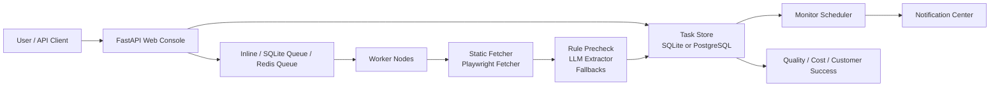

<p align="center">
  <h1 align="center">Smart Extractor</h1>
</p>

<p align="center">
  <strong>面向业务监控、运营治理与私有化交付的网页智能抽取平台</strong>
</p>

<p align="center">
  <a href="https://github.com/etaci/Smart-Extractor/actions"></a>
  <a href="https://github.com/etaci/Smart-Extractor/releases"></a>
  <a href="https://www.python.org/"></a>
  <a href="https://fastapi.tiangolo.com/"></a>
  <a href="https://playwright.dev/"></a>
  <a href="./LICENSE"></a>
</p>

<p align="center">
  <a href="#quick-start">Quick Start</a>
  ·
  <a href="#features">Features</a>
  ·
  <a href="#api">API</a>
  ·
  <a href="#deployment">Deployment</a>
  ·
  <a href="./docs/API文档.md">Docs</a>
</p>

---

Smart Extractor 把网页抓取、正文清洗、Schema 抽取、变化对比、模板沉淀、监控通知、质量反馈、成本看板、租户额度、代理池与 worker 队列放进同一条生产链路。

它适合从“单次网页抽取”自然升级到“持续变化监控”的场景，比如商品价格监控、招聘岗位监控、新闻/公告监控、政策信息追踪、竞品情报与私有化数据采集工作台。

## Highlights

| 能力 | 说明 |
|---|---|
| 智能结构化抽取 | 支持 `auto` 自动识别、内置 Schema、自定义字段、规则预检、LLM 抽取与规则兜底 |
| 静态 + 动态抓取 | httpx 静态抓取与 Playwright 动态抓取双模式，支持持久 profile、session 池、代理轮换与挑战页重试 |
| 变化监控闭环 | 页面历史、字段差异、影响摘要、监控调度、通知重试、通知摘要 |
| 模板增长路径 | 从成功任务生成模板，内置商品价格、招聘岗位、新闻/公告模板包，并提供模板市场接口 |
| 运营总览 | 今日任务数、成功率、失败分类、Token 成本、额度使用率、活跃监控、导出次数 |
| 质量与修复 | 字段级正确/错误/缺失反馈，沉淀模板评分、站点记忆与自动修复建议 |
| 客户成功 | 自动识别接近额度、失败率高、长时间未使用、模板成功率下降的租户或模板 |
| 分布式执行 | SQLite 队列、Redis 队列、多 worker 节点、队列隔离、worker 心跳 |
| 生产化治理 | PostgreSQL、迁移、备份恢复、健康检查、审计日志、登录、角色权限、导出权限控制 |

## Quick Start

### 1. 准备环境

需要 Python 3.12+ 和 [uv](https://docs.astral.sh/uv/)。

```bash
uv sync --dev
uv run playwright install chromium
```

### 2. 配置 LLM 与 Web Token

复制本地配置示例：

```powershell
Copy-Item config/local.example.yaml config/local.yaml
```

编辑 `config/local.yaml`：

```yaml
llm:
  api_key: "your-api-key-here"
  base_url: "https://api.openai.com/v1"
  model: "gpt-4o-mini"
  temperature: 0.0

web:
  api_token: "your-web-api-token"
  task_dispatch_mode: "inline"
```

也可以使用环境变量覆盖：

```powershell
$env:SMART_EXTRACTOR_API_KEY="your-api-key-here"
$env:SMART_EXTRACTOR_BASE_URL="https://api.openai.com/v1"
$env:SMART_EXTRACTOR_MODEL="gpt-4o-mini"
$env:SMART_EXTRACTOR_WEB_API_TOKEN="your-web-api-token"
```

配置优先级：

```text
环境变量 > config/local.yaml > config/default.yaml
```

### 3. 启动 Web 工作台

```bash
uv run smart-extractor web
```

打开：

```text
http://127.0.0.1:8000
```

上线前建议检查：

```bash
uv run smart-extractor db-migrate
curl http://127.0.0.1:8000/healthz
curl http://127.0.0.1:8000/readyz
```

## CLI

```bash
# 查看内置和自定义 Schema
uv run smart-extractor schemas

# 自动识别页面类型并抽取
uv run smart-extractor extract "https://example.com/page"

# 指定 Schema
uv run smart-extractor extract "https://example.com/article" --schema news

# 指定字段，适合临时业务抽取
uv run smart-extractor extract "https://example.com/page" --fields title,price,stock

# 静态抓取模式
uv run smart-extractor extract "https://example.com/page" --schema product --static

# 批量抽取
uv run smart-extractor batch urls.txt --schema product --format csv

# 从成功任务生成模板
uv run smart-extractor template-from-task task-xxxx --name "商品价格监控"

# 查看运行态、监控和模板
uv run smart-extractor runtime
uv run smart-extractor monitors
uv run smart-extractor templates
```

## Features

### Extraction

Smart Extractor 支持三类抽取方式：

- `auto`：自动判断页面类型并输出结构化数据。
- 固定 Schema：内置 `news`、`product`、`job`，也可在 `config/schemas` 下扩展 YAML Schema。
- 指定字段：直接传入字段名，适合一次性抽取或快速验证业务假设。

抽取链路包含：

- 静态抓取与 Playwright 动态抓取。
- HTML 清洗、正文保留、结构化提示词。
- LLM 用量统计与成本估算。
- 规则预检、规则兜底和学习型 profile。
- JSON、CSV、SQLite、Markdown、XLSX、DOCX 导出。

### Monitoring

监控能力围绕“网页变化监控 + 结构化通知”构建：

- 从模板或任务创建监控。
- 定时调度、租约、暂停/恢复、手动运行。
- 字段级历史对比、变化摘要、影响分析。
- Webhook 类通知、失败重试和摘要通知。
- 默认通知策略，避免无意义噪声。

### Templates & Actor Market

模板是增长入口：

- 成功任务可以一键生成模板。
- 模板可转为持续监控。
- 模板评分会吸收任务成功率、字段正确率、字段缺失率和最近失败原因。
- 内置模板包覆盖商品价格监控、招聘岗位监控、新闻/公告监控。
- 预留 Actor/插件市场能力，对标可复用运行单元。

### Operations

运营侧接口已经包含：

- 运营总览：任务数、成功率、失败分类、Token 成本、额度使用率、导出次数。
- 成本看板：每任务 token、模型费用估算、Playwright 耗时、重试成本。
- 质量看板：抽取成功率、字段反馈、模板评分、人工确认。
- 客户成功：接近额度、失败率高、长期未使用、模板成功率下降主动提醒。
- 失败自诊断：403、验证码/挑战页、超时、字段缺失、模型异常均返回可操作建议。

### Security & Governance

上线相关能力：

- 登录、会话、角色权限与 API Token 兼容。
- API Key 加密存储。
- 审计日志、任务 review、字段级人工反馈。
- 多租户字段、额度计划、导出权限控制。
- Host 校验、CSRF、限流、请求体大小限制、安全响应头。
- `/healthz`、`/readyz`、`/api/readiness` 健康与上线准入检查。

## Architecture



## API

常用接口：

| Endpoint | 用途 |
|---|---|
| `POST /api/extract` | 创建单 URL 抽取任务 |
| `POST /api/batch` | 创建批量抽取任务 |
| `GET /api/dashboard` | 仪表盘聚合数据 |
| `GET /api/task/{task_id}` | 任务详情、历史、对比、失败诊断 |
| `GET /api/task/{task_id}/export` | 导出 JSON / Markdown / XLSX / DOCX |
| `POST /api/task/{task_id}/template` | 从成功任务生成模板 |
| `GET /api/templates` | 模板列表 |
| `GET /api/template_scores` | 模板评分 |
| `GET /api/template_market` | 模板市场 |
| `GET /api/actor_market` | Actor/插件市场 |
| `GET /api/monitors` | 监控列表 |
| `POST /api/monitors/{monitor_id}/run` | 手动运行监控 |
| `GET /api/quality` | 质量看板 |
| `GET /api/cost` | 成本看板 |
| `GET /api/usage` | 额度与用量 |
| `GET /api/customer_success` | 客户成功看板与自动提醒 |
| `GET /api/operational_metrics` | 任务运行指标 |
| `GET /api/workers` | worker 节点 |
| `GET /api/proxies` | 代理池 |
| `GET /api/site_policies` | 站点级限速与执行策略 |
| `GET /api/audit` | 审计日志 |

鉴权方式：

```bash
curl -H "X-API-Token: your-web-api-token" http://127.0.0.1:8000/api/dashboard
```

## Deployment

### Docker Compose

默认 Compose 使用 PostgreSQL，更接近正式部署：

```powershell
$env:SMART_EXTRACTOR_API_KEY="your-api-key-here"
$env:SMART_EXTRACTOR_WEB_API_TOKEN="your-web-api-token"
$env:SMART_EXTRACTOR_AUTH_SECRET_KEY="replace-with-a-long-random-secret"
$env:SMART_EXTRACTOR_CONFIG_SECRET_KEY="replace-with-a-long-random-secret"
docker compose up -d --build
```

访问：

```text
http://localhost:8000
```

### 队列与 Worker

本地 SQLite 队列：

```yaml
web:
  task_dispatch_mode: "queue"
  start_builtin_worker: false
```

启动：

```bash
uv run smart-extractor web
uv run smart-extractor web-worker
```

Docker Compose worker：

```powershell
$env:SMART_EXTRACTOR_WEB_TASK_DISPATCH_MODE="queue"
docker compose --profile queue up -d --build
```

Redis 队列：

```powershell
$env:SMART_EXTRACTOR_WEB_TASK_DISPATCH_MODE="redis"
$env:SMART_EXTRACTOR_WEB_REDIS_URL="redis://localhost:6379/0"
uv run smart-extractor web
uv run smart-extractor web-worker
```

### 数据库维护

```bash
# 初始化或迁移数据库
uv run smart-extractor db-migrate

# 逻辑备份
uv run smart-extractor db-backup

# 从备份恢复
uv run smart-extractor db-restore output/backups/task-store-backup-xxxx.json
```

## Configuration

生产环境优先使用环境变量：

| 变量 | 说明 |
|---|---|
| `SMART_EXTRACTOR_API_KEY` | LLM API Key |
| `SMART_EXTRACTOR_BASE_URL` | OpenAI-compatible API Base URL |
| `SMART_EXTRACTOR_MODEL` | 模型名 |
| `SMART_EXTRACTOR_WEB_API_TOKEN` | API Token |
| `SMART_EXTRACTOR_AUTH_SECRET_KEY` | Web 会话签名密钥 |
| `SMART_EXTRACTOR_CONFIG_SECRET_KEY` | 本地敏感配置加密密钥 |
| `SMART_EXTRACTOR_STORAGE_DATABASE_URL` | 主数据库 URL |
| `SMART_EXTRACTOR_STORAGE_TASK_STORE_DATABASE_URL` | 任务治理数据库 URL |
| `SMART_EXTRACTOR_WEB_TASK_DISPATCH_MODE` | `inline` / `queue` / `redis` |
| `SMART_EXTRACTOR_WEB_REDIS_URL` | Redis 连接地址 |
| `SMART_EXTRACTOR_FETCHER_PROXY_URLS` | 多代理入口 |
| `SMART_EXTRACTOR_FETCHER_BROWSER_SESSION_POOL_SIZE` | 浏览器 session 池大小 |
| `SMART_EXTRACTOR_FETCHER_PERSISTENT_PROFILE_POOL_SIZE` | 持久 profile 池大小 |

## Repository Layout

```text
.
├─ config/
│  ├─ default.yaml              # 默认配置
│  ├─ local.example.yaml        # 本地配置示例
│  └─ schemas/                  # 自定义 Schema
├─ docs/                        # API 文档、用户手册、规划和优化报告
├─ src/smart_extractor/
│  ├─ cleaner/                  # HTML 清洗
│  ├─ extractor/                # LLM、规则兜底、学习型 profile
│  ├─ fetcher/                  # httpx / Playwright 抓取
│  ├─ models/                   # Pydantic 数据模型
│  ├─ scheduler/                # 批量调度
│  ├─ security/                 # 配置加密
│  ├─ storage/                  # JSON / CSV / SQLite 存储
│  ├─ utils/                    # 日志、编码、重试、反检测
│  ├─ validator/                # 数据质量校验
│  └─ web/                      # FastAPI、任务、监控、通知、模板、worker
├─ tests/                       # 单元测试与 Web 路由测试
├─ Dockerfile
├─ docker-compose.yml
├─ pyproject.toml
└─ uv.lock
```

## Testing

```bash
uv run pytest
```

更快的后端回归：

```bash
uv run pytest tests/test_web_task_store.py tests/test_web_routes.py tests/test_web_task_execution.py tests/test_web_task_worker.py
```

## Launch Checklist

- 设置 `SMART_EXTRACTOR_WEB_API_TOKEN`、`SMART_EXTRACTOR_AUTH_SECRET_KEY`、`SMART_EXTRACTOR_CONFIG_SECRET_KEY`。
- 生产环境使用 PostgreSQL，避免直接用本地 SQLite 承载公网 SaaS。
- 队列模式建议接 Redis，并独立启动 worker。
- 配置日志采集、备份策略和 `/readyz` 健康检查。
- 检查目标站条款、robots、数据合规、敏感信息采集边界。
- 上线后持续关注 `/api/quality`、`/api/cost`、`/api/customer_success`。

## Tech Stack

- Python 3.12+
- FastAPI, Uvicorn, Jinja2
- Playwright, httpx, BeautifulSoup4, lxml
- Pydantic v2, pydantic-settings
- OpenAI SDK, Instructor, tiktoken
- SQLite, PostgreSQL, Redis
- pandas, openpyxl, python-docx
- Typer, Rich, Loguru
- Pytest

## License

Smart Extractor is released under the [MIT License](./LICENSE).

## Contact

Questions, ideas, private deployment discussions:

```text
yitachi081@gmail.com
```

## Disclaimer

本项目按“现状”提供，不附带任何明示或暗示担保。使用者应自行确认使用方式符合目标网站条款、当地法律法规、robots 约束、数据合规要求和隐私保护要求。
